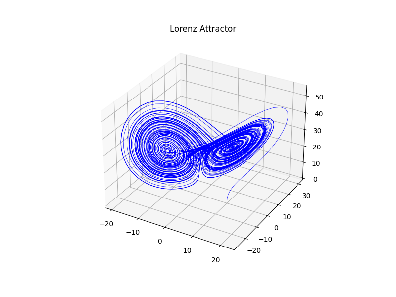

# Lorenz Attractor

Numerical simulation of the Lorenz system using the Euler method.

The Lorenz equations are a system of three coupled ordinary differential equations that exhibit chaotic behaviour for certain parameter values. This script integrates the equations and visualises the characteristic "butterfly" trajectory in 3D phase space.

## Equations

```
dx/dt = σ (y - x)
dy/dt = x (ρ - z) - y
dz/dt = x y - β z
```

Default parameters:
- σ = 10.0
- ρ = 28.0
- β = 8/3

## Requirements

- Python 3
- NumPy
- Matplotlib

Install dependencies:

```bash
pip install numpy matplotlib
```

## Usage

```bash
python lorenz.py
```

The script integrates the system using the Euler method with a fixed time step (`dt = 0.01`) up to `tmax = 100`. It then plots the 3D trajectory.

## Output

A 3D plot of the Lorenz attractor is displayed.

